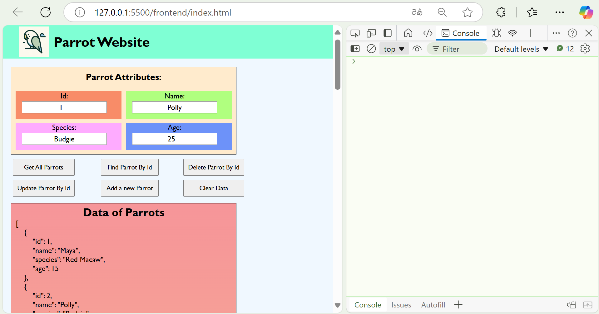
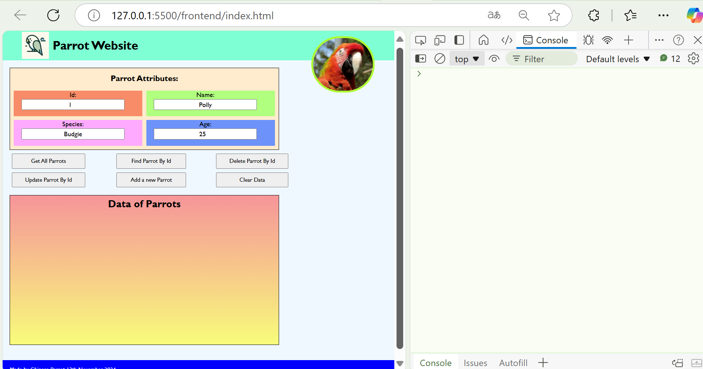
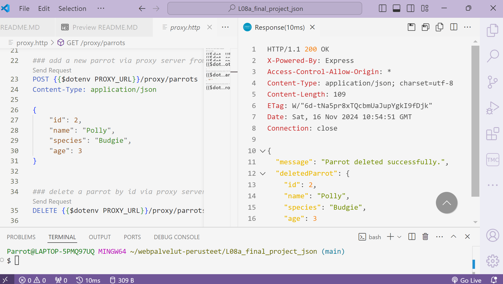
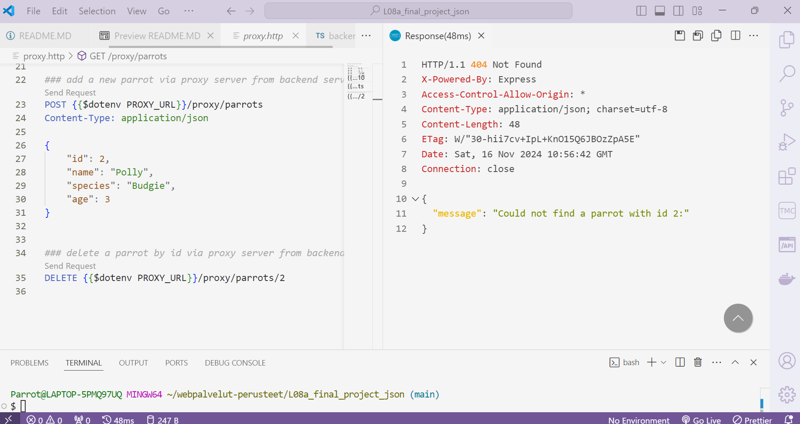
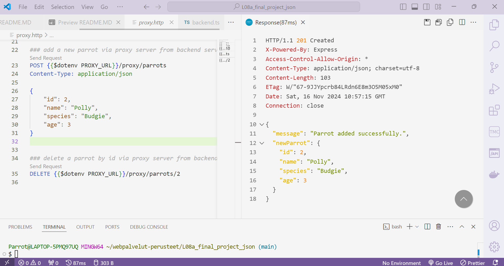
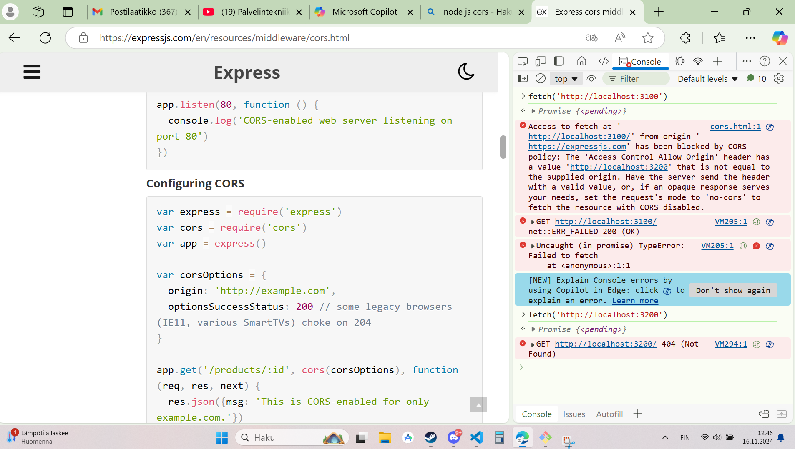
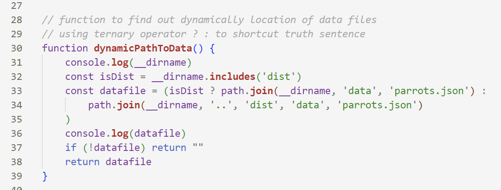

# Proxy + Backend Typescript Project With SQLite
- Group: Lonely Parrot
- Maker: Joonas Harjula
- Student number: 2200672

- I used JSON data storage for this project.

## How to use the program?

- Proxy has port 3200, backend has port 3100
- Idea is that, when both services are turned on,
- Person can fetch, delete, update and create (CRUD operations)
- data of parrots. It works both on frontend view and on the
- backend.http and proxy.http files
- 
- 
- 
- 

### Commands to run the program:
- If person wants to try out typescript:
  - npm run dev1
  - npm run dev2
- If person wants to use the production JS code:
  - npm run build
  - npm run start1
  - npm run start2

## About cors policy
 - Cors policy was made as next:
 - A. Backend allows only the proxy server aka http://localhost:3200 as source for requests
 - B. Proxy allows every origin as source for requests
 - 

## Location of JSON data
- In this project i chose to use JSON, because
- it felt interesting to try to "original" way of storing data.
- I used a dynamic way to define the location of data
- so that both typescript and js files access the same data
- 